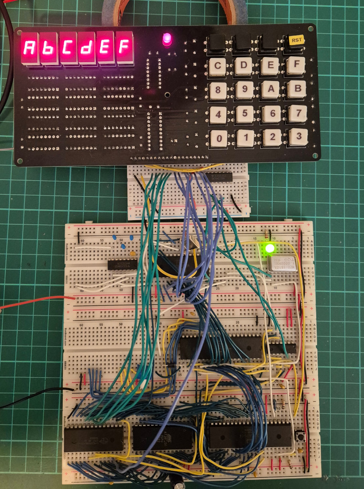

Generic Front Panel
===================

This repository contains schematics and other information for a generic
front panel for 8-bit homebrew computers.

Here it is connected to my version of
[Ben Eater's 6502 Breadboard Computer](https://eater.net/6502),
running the "hello.s" example from the "src/6502" directory.
It is shown here after I typed ABCDEF on the keypad:

Here is a close-up of the front panel with a 3D-printed plate over the top:

The "print" directory contains an OpenSCAD file for the 3D-printable plate.
My brother, who is into 3D-printing, has a textured print bed for his printer.
He printed the plate upside down and the texturing gave the plate a nice finish.

## Features

The generic front panel has the following features:

* 6-digit seven segment display.
* 16-digit hexadecimal keypad.
* 3 extra keys for "CMD1", "CMD2", and "CMD3" which can be assigned
  any commands you like by your software.
* 1 extra key for a system reset button.
* 20-pin connector to the rest of your homebrew system.
* Power LED for the 5V power rail.

Note that this front panel requires software support.  It doesn't directly
operate the address bus, data bus, clock, and other control lines like
front panels of old.

What this front panel does do is make it easy to write a memory monitor in
software that can examine memory, modify memory, single-step, and so on.
The 6 displays can display a 16-bit address and an 8-bit byte.  Or anything
else you like, even words.

The seven segment displays, keypad buttons, and power LED are mounted
on the front side of the PCB.  All other components are mounted on the
back side.  The inline current limiting resistors are specified as 8-way
resistor arrays.  However, you could fit 8 regular resistors side by side
instead.

The front panel draws about 250mA from the 5V rail when all 48 segments
in the 7-segment displays and the power LED are lit.  About 5mA per segment.

I have provided drivers and examples for various CPU's under the
"src" directory.  Patches welcome for other CPU's and homebrew boards.

## Schematic and gerber files

* [PDF of the schematic](schematics/Generic_Front_Panel/PDF/Generic_Front_Panel.pdf)
* [Gerber files for manufacture](schematics/Generic_Front_Panel/Gerbers)

The dimensions of the PCB are 195mm x 90mm.  Five 3mm mounting holes are
provided for mounting behind a face plate: four corners and one in the
centre for added strength.

## Parts list

* 1 x Generic Front Panel FP-01 PCB
* 1 x 74HC138 3-line to 8-line decoder (74LS138 or 74HCT138 can be substituted)
* 1 x 74HC244 octal buffer / line driver (74LS244 or 74HCT244 can be substituted)
* 6 x 74HC259 addressable latch (74LS259 or 74HCT239 can be substituted)
* 6 x 100nF ceramic or monolithic capacitor
* 5 x 100pF ceramic capacitor
* 1 x 100uF electrolytic capacitor, rated for 6.3V or better
* 6 x 470 ohm DIP-16 resistor array
* 5 x 4.7K ohm resistor
* 1 x 220 ohm resistor (series resistor for 5mm power LED, adjust value for the LED's current rating)
* 1 x 5mm LED for the power LED (color is up to you)
* 6 x MAN71A 7-segment LED display (TIL-312 or Broadcom 5082-7611 can be substituted)
* 5 x 1N4148 diode
* 20 x 12mm push button plus keycaps
* 1 x 20-pin 2.54mm pitch terminal header or socket for the J1 connector

I recommend using DIP-14 sockets for the 7-segment LED displays to
raise the height of the displays up to roughly level with the top of the
push buttons plus keycaps.  Sockets for the other IC's are up to you;
I didn't bother.

Labels can be applied to the keycaps using a label maker and clear labels.

This is what the front and back of the PCB looks like once assembled
(I had only done a very basic board clean at this point so it is still a
little smudgy):

## 20-pin connector

The connector on the bottom of the PCB has the following pins:

<table border="1">
<tr><td><b>Pin</b></td><td><b>Description</b></td></tr>
<tr><td>1</td><td>+5V</td></tr>
<tr><td>2</td><td>D0</td></tr>
<tr><td>3</td><td>D1</td></tr>
<tr><td>4</td><td>D2</td></tr>
<tr><td>5</td><td>D3</td></tr>
<tr><td>6</td><td>D4</td></tr>
<tr><td>7</td><td>D5</td></tr>
<tr><td>8</td><td>D6</td></tr>
<tr><td>9</td><td>D7</td></tr>
<tr><td>10</td><td>A0</td></tr>
<tr><td>11</td><td>A1</td></tr>
<tr><td>12</td><td>A2</td></tr>
<tr><td>13</td><td>A3</td></tr>
<tr><td>14</td><td>A4</td></tr>
<tr><td>15</td><td>A5</td></tr>
<tr><td>16</td><td>Select Display (active low)</td></tr>
<tr><td>17</td><td>Select Keypad (active low)</td></tr>
<tr><td>18</td><td>Reset (active low)</td></tr>
<tr><td>19</td><td>GND</td></tr>
<tr><td>20</td><td>GND</td></tr>
</table>

## Chip selects

To interface to your homebrew computer, you will need to provide address
decoding for the two "chip select" lines "Select Display" and "Select Keypad".

You can put the front panel anywhere in memory or I/O space that is
aligned on a 64-byte boundary.  Only the bottom 6 address bits are
provided to the front panel.  You need to decode the upper 10 bits
(of a 16-bit address) yourself by some means.

"Select Display" should be low when the top-most bits of the address
match the location in memory where you want to put the display,
and when the bus is in a write cycle.  The display occupies 64 bytes
of memory space.

"Select Keypad" should be low when the top-most bits of the address
match the location in memory where you want to put the keypad,
and when the bus is in a read cycle.  The keypad occupies 32 bytes
of memory space.  It can overlap with the display in memory if that
is easier.

## Writing to the display

Each segment of the display has its own memory address.  Each digit
occupies 8 bytes of memory space, for the segments A, B, C, D, E, F, G,
and decimal point.  The displays are at offsets 0, 8, 16, 24, 32,
and 40 in the memory space.

Write a byte with the low bit set to 0 to a segment's address to turn
the segment on, or write a byte with the low bit set to 1 to turn the
segment off.  The segment will stay lit until modified or the power is
turned off.  The display is not multiplexed so there is no need to
constantly refresh.

Writing any byte value to offset 56 will turn all segments on.
This can be useful for testing.  Normally you will want to turn
everything off at startup time.

The "one byte per segment" design was borrowed from the Heathkit ET-3400.
74HC259 addressable latches are used to individually address each segment,
and to remember the state of the segment between writes.

## Reading from the keypad

The keypad consists of 5 rows of 4 keys.  The rows are associated with
address bits A0 to A4.  Scan through the keypad one row at a time,
setting one address bit to 0 and the rest to 1.  When you read from that
address, the bits that are set to zero indicate which keys are pressed
on that row.

<table border="1">
<tr><td><b>Address</b></td><td><b>Bit</b></td><td><b>Key</b></td></tr>
<tr><td>$XX1E (A0)</td><td>0</td><td>0</td></tr>
<tr><td>$XX1E (A0)</td><td>1</td><td>1</td></tr>
<tr><td>$XX1E (A0)</td><td>2</td><td>2</td></tr>
<tr><td>$XX1E (A0)</td><td>3</td><td>3</td></tr>
<tr><td>$XX1D (A1)</td><td>0</td><td>4</td></tr>
<tr><td>$XX1D (A1)</td><td>1</td><td>5</td></tr>
<tr><td>$XX1D (A1)</td><td>2</td><td>6</td></tr>
<tr><td>$XX1D (A1)</td><td>3</td><td>7</td></tr>
<tr><td>$XX1B (A2)</td><td>0</td><td>8</td></tr>
<tr><td>$XX1B (A2)</td><td>1</td><td>9</td></tr>
<tr><td>$XX1B (A2)</td><td>2</td><td>A</td></tr>
<tr><td>$XX1B (A2)</td><td>3</td><td>B</td></tr>
<tr><td>$XX17 (A3)</td><td>0</td><td>C</td></tr>
<tr><td>$XX17 (A3)</td><td>1</td><td>D</td></tr>
<tr><td>$XX17 (A3)</td><td>2</td><td>E</td></tr>
<tr><td>$XX17 (A3)</td><td>3</td><td>F</td></tr>
<tr><td>$XX0F (A4)</td><td>0</td><td>CMD1</td></tr>
<tr><td>$XX0F (A4)</td><td>1</td><td>CMD2</td></tr>
<tr><td>$XX0F (A4)</td><td>2</td><td>CMD3</td></tr>
<tr><td>$XX0F (A4)</td><td>3</td><td>(not used)</td></tr>
</table>

The "Reset" key is special.  It will pull pin 18 on the connector
down to GND when pressed.  It is assumed that a pull-up resistor and
debouncing capacitor are present on your main computer board.
If you want to use "Reset" for something else (such as a "CMD4" key),
you can connect pin 18 to an I/O pin on your main computer board.

The "rows as addresses" design was borrowed from the VZ200 / Laser 200.
Only a single 74HC244 bus transceiver is required to read the keypad.
Everything else is pushbuttons, diodes, resistors, and capacitors.

There are jumpers on the back of the board that can be cut to wire
up additional keys if you need more than 20.  The extra keys will
be available as bits 4 through 7.  The bits are pulled high if the
jumpers are uncut.

## License

MIT License.

## Contact

For more information on this project, to report bugs, or to suggest
improvements, please contact the author Rhys Weatherley via
[email](mailto:rhys.weatherley@gmail.com).
