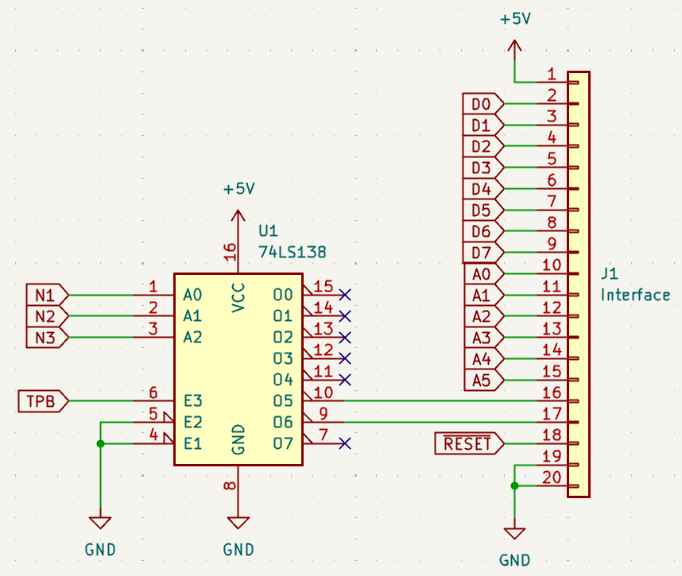

This directory contains driver code for 1802-based machines in "fp\_driver.asm".

The front panel should be wired up to the 1802 microprocessor as follows:

Output 5 is used for the display and input 6 is used for the keypad.
If you change these, then modify the "FP\_PORT\_OUT" and "FP\_PORT\_IN"
definitions in "fp\_driver.asm".

The "hello.asm" example scrolls "HELLORLD!" followed by the printable ASCII
characters across the display from right to left.

Press any key except RESET to stop the scrolling message.  Keys pressed
after that (except RESET) will be shown on the display, scrolling in from
the right.  This allows all keys on the keypad to be tested.  Press RESET
to start again with the scrolling message.
