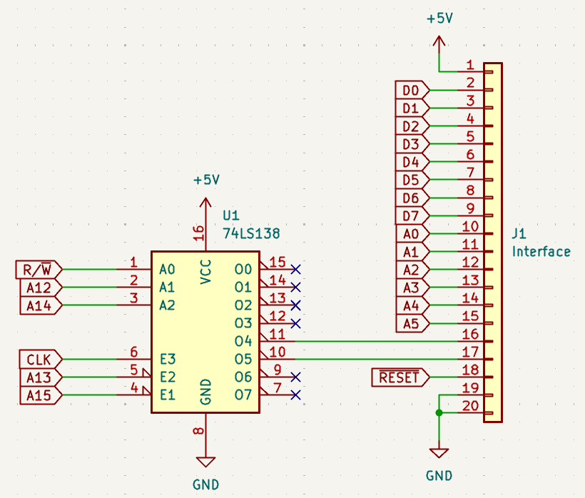
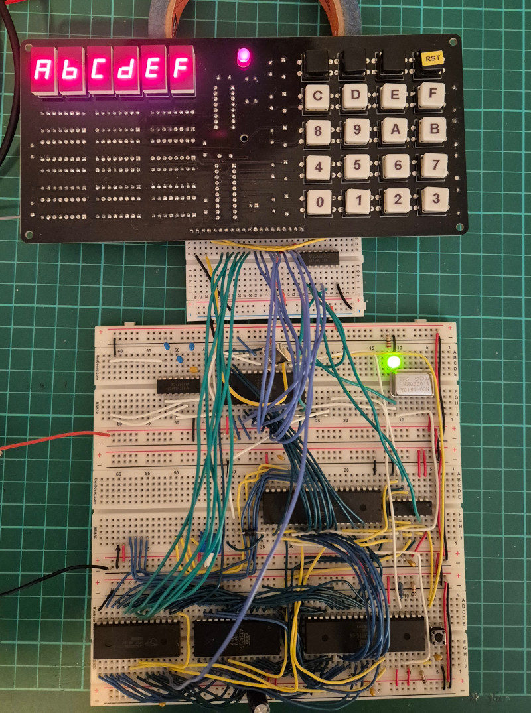

This directory contains driver code for 6502-based machines in "fp\_driver.s".

The "hello.s" example is designed to work with
[Ben Eater's 6502 Breadboard Computer](https://eater.net/6502), with the
front panel placed at address $4000 in memory.  The front panel should be
wired up to the breadboard computer as follows:

The example scrolls "HELLORLD" followed by the printable ASCII characters
across the display from right to left.

Press any key except RESET to stop the scrolling message.  Keys pressed
after that (except RESET) will be shown on the display, scrolling in from
the right.  This allows all keys on the keypad to be tested.  The three
command keys will be displayed as G, H, and I.

Press RESET to start again with the scrolling message.

Here it is connected to my version of Ben Eater's 6502 Breadboard Computer,
shown here after I typed ABCDEF on the keypad:

The "monitor.s" file implements a machine code monitor for 6502 computers
in just 2K of ROM space.  More information is in the
[documentation for the monitor](../../doc/monitor.md).
